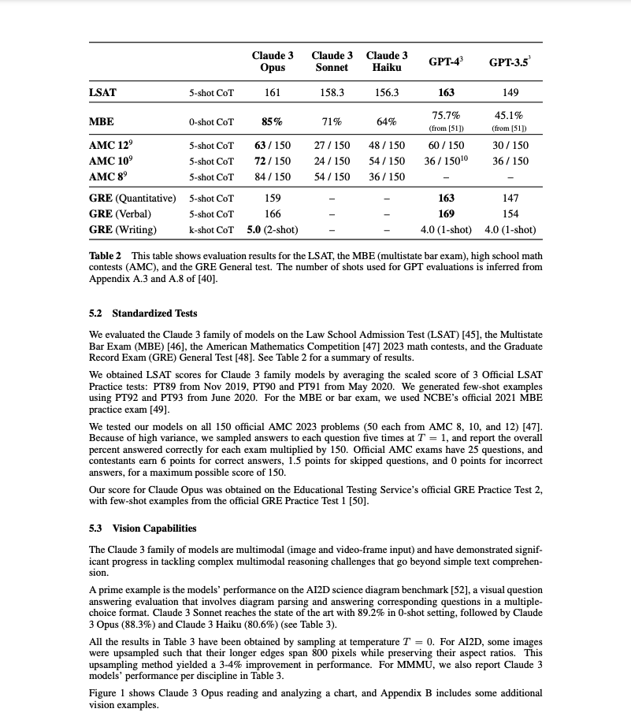
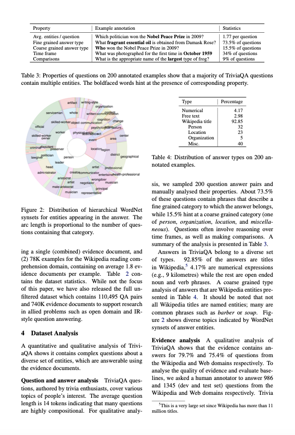

# Claudetools Vision Example

This repository contains an example of how we can use the [`claudetools`](https://github.com/vatsalsaglani/claudetools) package to use function calling with vision input to the Claude 3 family of models.

## Task

The task is to extract text, tables, and image from a given document image in a structured manner. Whenever it encounters images it has to note the figure or image number and what the image contains. _The Claude 3 models cannot provide the bounding box coordinates of the images on a document hence, we just ask it to explain what's the image or write down what's on the image._

## Setup

The following are the quick setup steps.

### Installing requirements

```sh
pip install -r requirements.txt
```

### Starting the server

```sh
python app.py
```

### Testing on Document images

There are four test images in the `images/` folder. You can go to the `tests/test_1.py` file and update the main block to test on the file you want to. Also you can test on your own images.

```sh
python -m tests.test_1
```

## Example Outputs

Let's look at some of the outputs

### Image 1



#### Output

```json
[
    {
        "page_meta_info": {
            "meta_info": "The image contains a table with evaluation results for various models on the LSAT, MBE, AMC, and GRE tests. There are 3 paragraphs of text below the table providing more details on the evaluation. The image contains no additional images."
        },
        "content": [
            {
                "content_label": "table",
                "table_description": "This table shows evaluation results for the LSAT, the MBE (multistate bar exam), high school math contests (AMC), and the GRE General test. The number of shots used for GPT evaluations is inferred from Appendix A.3 and A.8 of [40].",
                "content": [
                    {
                        "": "LSAT",
                        "Claude 3 Opus": "5-shot CoT",
                        "Claude 3 Sonnet": "161",
                        "Claude 3 Haiku": "158.3",
                        "GPT-4": "156.3",
                        "GPT-3.5": "163"
                    },
                    {
                        "": "MBE",
                        "Claude 3 Opus": "0-shot CoT",
                        "Claude 3 Sonnet": "85%",
                        "Claude 3 Haiku": "71%",
                        "GPT-4": "64%",
                        "GPT-3.5": "75.7%"
                    },
                    {
                        "": "AMC 12",
                        "Claude 3 Opus": "5-shot CoT",
                        "Claude 3 Sonnet": "63 / 150",
                        "Claude 3 Haiku": "27 / 150",
                        "GPT-4": "48 / 150",
                        "GPT-3.5": "60 / 150"
                    },
                    {
                        "": "AMC 10",
                        "Claude 3 Opus": "5-shot CoT",
                        "Claude 3 Sonnet": "72 / 150",
                        "Claude 3 Haiku": "24 / 150",
                        "GPT-4": "54 / 150",
                        "GPT-3.5": "36 / 150"
                    },
                    {
                        "": "AMC 8",
                        "Claude 3 Opus": "5-shot CoT",
                        "Claude 3 Sonnet": "84 / 150",
                        "Claude 3 Haiku": "54 / 150",
                        "GPT-4": "36 / 150",
                        "GPT-3.5": "\u2014"
                    },
                    {
                        "": "GRE (Quantitative)",
                        "Claude 3 Opus": "5-shot CoT",
                        "Claude 3 Sonnet": "159",
                        "Claude 3 Haiku": "\u2014",
                        "GPT-4": "\u2014",
                        "GPT-3.5": "163"
                    },
                    {
                        "": "GRE (Verbal)",
                        "Claude 3 Opus": "5-shot CoT",
                        "Claude 3 Sonnet": "166",
                        "Claude 3 Haiku": "\u2014",
                        "GPT-4": "\u2014",
                        "GPT-3.5": "169"
                    },
                    {
                        "": "GRE (Writing)",
                        "Claude 3 Opus": "k-shot CoT",
                        "Claude 3 Sonnet": "5.0 (2-shot)",
                        "Claude 3 Haiku": "\u2014",
                        "GPT-4": "\u2014",
                        "GPT-3.5": "4.0 (1-shot)"
                    }
                ]
            },
            {
                "content_label": "text",
                "content": "5.2 Standardized Tests\n\nWe evaluated the Claude 3 family of models on the Law School Admission Test (LSAT) [45], the Multistate Bar Exam (MBE) [46], the American Mathematics Competition [47] 2023 math contests, and the Graduate Record Exam (GRE) General Test [48]. See Table 2 for a summary of results."
            },
            {
                "content_label": "text",
                "content": "We obtained LSAT scores for Claude 3 family models by averaging the scaled score of 3 Official LSAT Practice tests: PT89 from Nov 2019, PT90 and PT91 from May 2020. We generated few-shot examples using PT92 and PT93 from June 2020. For the MBE or bar exam, we used NCBE's official 2021 MBE practice exam [49]."
            },
            {
                "content_label": "text",
                "content": "We tested our models on all 150 official AMC 2023 problems (50 each from AMC 8, 10, and 12) [47]. Because of high variance, we sampled answers to each problem over 10 trials, and report the overall percent answered correctly for each exam multiplied by 150. Official AMC exams have 25 questions, and contestants earn 6 points for correct answers, 1.5 points for skipped questions, and 0 points for incorrect answers, for a maximum possible score of 150.\n\nOur score for Claude Opus was obtained on the Educational Testing Service's official GRE Practice Test 2, with few-shot examples from the official GRE Practice Test 1 [50]."
            },
            {
                "content_label": "text",
                "content": "5.3 Vision Capabilities\n\nThe Claude 3 family of models are multimodal (image and video-frame input) and have demonstrated significant progress in tackling complex multimodal reasoning challenges in a broad range of simple text comprehension.\n\nA prime example is the models' performance on the AI2D science diagram benchmark [52], a visual question answering evaluation that involves diagram parsing and answering corresponding questions in a multiple-choice format. Claude 3 Sonnet reaches the state of the art with 89.2% in a zero-shot setting, followed by Claude 3 Opus (88.3%) and Claude 3 Haiku (80.6%) (see Table 3).\n\nAll the results in Table 3 have been obtained by sampling at temperature T = 0. For AI2D, some images were broken, so we omit their longer edge span greater than 384 pixels, and report near perfect ratios. This upsampling method yielded a 3-4% improvement in performance. For MMMU, we also report Claude 3 models' performance on the test set in Table 3.\n\nFigure 1 shows Claude 3 Opus reading and analyzing a chart, and Appendix B includes some additional vision examples."
            }
        ]
    }
]
```

### Image 2



#### Output

```json
[
    {
        "page_meta_info": {
            "meta_info": "The image contains 2 paragraphs of text, 2 tables, and 1 pie chart image. The text paragraphs are at the top and bottom of the page. Table 3 is in the middle left and Table 4 is in the bottom right. The pie chart image is in the middle right of the page."
        },
        "content": [
            {
                "content_label": "text",
                "content": "Property Example annotation Statistics\nAvg. entities / question Which politician won the Nobel Peace Prize in 2009? 1.77 per question\nFine grained answer type What fragrant essential oil is obtained from Damask Rose? 15.5% of questions\nCoarse grained answer type What was the Nobel Peace Prize in 2009? 54% of questions\nDirect answers Who won the Nobel Peace Prize in 2009? Barack Obama 3.9% of questions\nComparisons What is the appropriate name of the largest type of frog? 9% of questions"
            },
            {
                "content_label": "table",
                "table_description": "Table 3: Properties of questions on 200 annotated examples show that a majority of TriviasQA questions contain multiple entities. The boldfaced words hint at the presence of corresponding property.",
                "content": [
                    {
                        "Type": "Numerical",
                        "Percentage": "4.17"
                    },
                    {
                        "Type": "Free text",
                        "Percentage": "2.98"
                    },
                    {
                        "Type": "Wikipedia title",
                        "Percentage": "92.85"
                    },
                    {
                        "Type": "Person",
                        "Percentage": "32"
                    },
                    {
                        "Type": "Location",
                        "Percentage": "23"
                    },
                    {
                        "Type": "Misc.",
                        "Percentage": "40"
                    }
                ]
            },
            {
                "content_label": "image",
                "content": "The image is a pie chart showing the distribution of answer types on 200 annotated examples. The largest slice is Wikipedia title at 92.85%, followed by Person at 32%, Misc. at 40%, Location at 23%, Numerical at 4.17%, and Free text at 2.98%."
            },
            {
                "content_label": "text",
                "content": "Figure 2: Distribution of hierarchical WordNet synsets for entities appearing in the answer. The arc length is proportional to the number of questions that category.\n\ning a single (combined) evidence document, and (2) 78% examples for the Wikipedia reading comprehension domain, containing on average 1.8 evidence documents per example. Table 2 contains the dataset statistics. While not the focus of this paper, we have also released the full unfiltered dataset which contains 110,495 QA pairs and 740K evidence documents to support research in allied problems such as open domain and IR-style question answering.\n\n4 Dataset Analysis\nA quantitative and qualitative analysis of TriviasQA shows it contains complex questions about a diverse set of entities, which are answerable using the contents of the evidence documents.\n\nQuestion and answer analysis TriviaQA questions, authored by trivia enthusiasts, cover various topics of people's interest. The average question length is 14 tokens indicating that many questions are highly compositional. For qualitative analy-\n\nsis, we sampled 200 question answer pairs and manually analysed their properties. 75.5% of these questions contain phrases that describe a fine grained category to which the answer belongs, while 15.5% hint at a coarse grained category (one of person, organization, location, and miscellaneous). Questions often involve reasoning about time frames, as well as making comparisons. A summary of the analysis is presented in Table 3.\n\nAnswers in TriviaQA belong to a diverse set of types. 92.85% of the answers are titles in Wikipedia, 4.17% are numerical expressions (e.g., 9 kilometers), and 2.98% are free form text noun and verb phrases. A coarse grained type analysis of answer phrases (based on presence of named entities) is presented in Table 4. It should be noted that not all Wikipedia titles are named entities; many are common phrases such as barber or first-time offence. The 2 shows diverse topics indicated by WordNet synsets of answer entities.\n\nEvidence analysis A qualitative analysis of TriviaQA shows that the evidence contains answers for 79.7% and 75.4% of questions from the Wikipedia and Web domains respectively. To analyse the quality of evidence documents' boundaries, we asked a human annotator to answer 986 and 1345 dev and test set questions from the Wikipedia and Web domains respectively. Trivia"
            }
        ]
    }
]
```